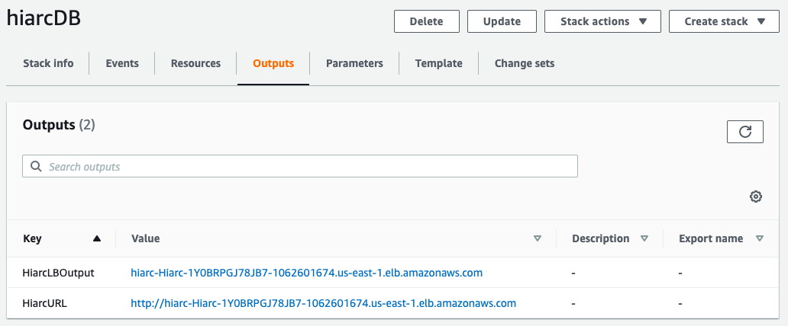

# Hiarc

> :warning: Hiarc is currently pre-release software. If you are interested in trying it out please email <try@hiarcdb.com>
> and we'll be happy to help you get it up and running.

**Hiarc is an API that adds enterprise features to simple cloud storage.** You can run it yourself and orchestrate all of your enterprise content requirements across cloud environments. Whether it's AWS, Azure, or Google, Hiarc supports it (with more platforms to come).  By leveraging the cloud infrastructure you already use, Hiarc leaves critical data under your control.  Every file and every event resides in your infrastructure, with Hiarc providing the connective tissue around permissions, organization, access, and scale.

Hiarc leverages a powerful graph database to scale up to billions of files and hundreds of millions of users with <100ms response times. By sitting between your application code and your cloud infrastructure, Hiarc acts as an organizational and control layer, providing key pieces of functionality required in complex enterprise workflows.

### Why Use Hiarc?
* **Elevate Your Cloud** - Hiarc is designed as a modern API layer that sits on top of your existing cloud infrastructure.  Amazon, Microsoft, and Google have spend billions perfecting simple, robust file storage systems. However, these systems lack granular control, flexible user models, hierarchical permissions, complex metadata, per-file retention policies and other features needed to facilitate enterprise workflows.  Hiarc gives you those features while letting you own the underlying cloud infrastructure. You don't need to expose your critical data to another company.

* **Replace Legacy ECM** - If you're like many enterprises, you've relied on legacy ECM solutions like Documentum, FileNet, and OpenText to support your critical workflows.  These solutions are expensive, complicated, proprietary, and not cloud-friendly.  Hiarc is an open source, community built solution that can help you leave behind these legacy systems with their complexity and high costs.

* **Avoid Vendor Lock-in** - With Hiarc you can start out with one cloud provider and easily migrate to another.  The ability to seamlessly switch cloud storage providers gives you incredible leverage.  Simply add a new storage service and migrate your files or just put new versions of files there as they are created.  

* **Go Multi-Cloud** - For mission critical workflows it can be imperative to replicate data across multiple cloud data centers.  Hiarc supports adding as many storage services across AWS, Azure, and Google Cloud as you need.  Because the definition of files, their metadata and versions is controlled by Hiarc and not the cloud vendors, you can leverage as many cloud data centers as you require.

* **Massive Scalability** - Hiarc leverages a powerful, industry-leading graph database that supports billions of objects and is able to perform queries in milliseconds that would take SQL and NoSQL databases minutes because of their recursive nature.  Coupled with the incredible scale of cloud content services, Hiarc can power your largest workflows.

### Supported Cloud Infrastructure
* Storage Services
  * AWS
  * Azure
  * Google Cloud
* Event & Audit Trail Services
  * Amazon Kinesis
  * Azure Service Bus
  * Google PubSub
  * Webhooks
  
### Key Concepts
* **A Key for Everything** - Every object in Hiarc is uniquely identified by an application specified key.  Similar to key-value stores like Redis or Memcached, Hiarc supports efficient object lookup by letting you construct keys using data you already have. For example, you could create a collection for collaborating between a financial advisor and a client.  The key could be ```"/portal/{advisorId}/{clientId}"```.  When you need the list of files in the collection you simply ask Hiarc using the key you know how to construct.  No need to store IDs in yet another database.

* **Metadata Everywhere** - Every object in Hiarc supports setting metadata values and querying based on those values.  Metadata is such an important part of complex workflows that it should be ubiquitous.

* **Direct Upload/Download** - With Hiarc you have two ways you can upload and download files.  Some scenarios require that all files should flow through your Hiarc servers, and that is supported.  For other scenarios it is more efficient to allow clients to upload and download directly to your cloud storage buckets using time limited, pre-signed URLs.  Hiarc also fully supports this model and based on configuration simply does it automatically.

* **Multi-Cloud by Default** - Hiarc seamlessly supports AWS, Azure, and Google cloud storage.  You can configure as many storage services as you need, and you can easily migrate and version files across them.  This helps prevent vendor lock-in, and it gives you the flexibility needed for complex workflows.  For example, you can easily move files that haven't been accessed in 90 days to your cheaper storage buckets without your application code needing to care.

* **Waterfall and ACL** - For many scenarios it is convenient to structure your content so that permissions flow down from parent collections to child collections.  If a user has read access to a parent collection any files below that should be accessible.  This is how folders work on your computer's filesystem. For other use cases this paradigm falls down.  Sometimes you need exact control as to who can access what.  Hiarc supports both modalities, allowing you to construct the optimal solution.

* **Events are First Class** - Increasingly, it's critical to understand exactly what is happening in every system you control as it's happening.  This facilitates the composition of disparate systems into a more cohesive solution. Hiarc fully supports this model by providing built-in support for multiple major event services.  Events like 'File Uploaded', 'Retention Policy Applied', and 'User Created' are instantly sent to as many supported services as you configure. 

* **Retention and Disposition** - Document retention is a feature required in many enterprise workflows.  Hiarc supports per-file retention policies that can be extended but never shortened. Once a file has a policy applied it can never be removed, even by the admin.  Even if a file moves across cloud providers the policy remains.  Additionally, Hiarc support file disposition when a policy expires, enforcing the deletion of all versions of the file across cloud storage containers.

### Key Objects
* **Users** - Your application almost certainly already has the concept of users, but Hiarc extends that concept into your cloud storage bucket.  Hiarc users typically map one-to-one with your application users, and they provide the context necessary to determine how a user can interact with files.

* **Groups** - Hiarc groups are a collection of users and they can be given different levels of permission to access content.  While Hiarc supports single-user collaboration, groups are the primary mechanism for determining who can access what.

* **Files** - The primary piece of data managed by Hiarc is a file.  Files are immutable but they have new versions over time as the data changes. Files are stored securely in the cloud storage bucket of your choosing.  You can migrate files between storage buckets, and you can even have different versions of a file located in different buckets.

* **Collections** - Files can be assembled into collections, like how you would use a folder on a file system.  The key difference is that Hiarc collections can have more than one parent and a file can be placed in more than one collection.  You can create hierarchies of collections by organizing them into parent and child relationships.  Permissions can flow down in waterfall style, or you can specify distinct ACLs depending on your exact requirements.

* **Retention Policies** - A key piece of highly regulated workflows, retention policies can be applied to files, ensuring that the file cannot be deleted until a certain period of time has gone by.  Retention policies, once applied, can never be removed, and the retention period can be extended but never shortened.  If a file has multiple policies applied, Hiarc will calculate the longest retention period and enforce it.

* **Classifications** - To make things even easier, Hiarc provides classifications which can be applied to files or collections.  A classification can specify retention policies that should be applied to a specific file, or to any file that ever becomes a member of a designated collection.  Even if the file is later removed from the collection the classification remains.  Classifications can be explicitly removed, but any retention policies applied will remain.

### Settings

Use the following environment variables to configure Hiarc:

- `HIARC_CONFIG_STRATEGY=env`
- `HIARC_SETTINGS=<base64 encoded json>`

If using `docker-compose` update `HIARC_SETTINGS` before running `docker-compose up`.

Assuming your settings are in a file called `appsettings.json`, use this command to generate your Hiarc settings:
```sh
cat appsettings.json | base64 > appsettings.txt
```

Copy the string in `appsettings.txt` and replace `HIARC_SETTINGS=<base64 encoded json>`.

`HIARC_SETTINGS` must be a base64 encoded JSON string. If you use the following example, be sure to replace any values formatted like this: `<value>`. These are the following settings Hiarc supports:

```json
{
    "BaseUri": "http://localhost:5000",
    "JwtSigningKey": "<jwt-signing-key>",
    "AdminApiKey": "<admin-api-key>",
    "ForceHTTPS": false,
    "JWTTokenExpirationMinutes": 43200,
    "Database": {
        "Uri": "<uri-for-neo4j>",
        "Username": "<neo4j-username>",
        "Password": "<neo4j-password>"
    },
    "StorageServices": [
        {
            "Provider": "AWS-S3",
            "Name": "<name>",
            "IsDefault": true,
            "AllowDirectDownload": true,
            "AllowDirectUpload": true,
            "Config": {
                "AccessKeyId": "<key>",
                "SecretAccessKey": "<secret>",
                "RegionSystemName": "<region-name>",
                "Bucket": "<bucket-name>"
            }
        },
        {
            "Provider": "Azure-Blob",
            "Name": "<name>",
            "IsDefault": false,
            "Config": {
                "StorageConnectionString": "<connection string>",
                "Container": "container-name"
            }
        },
        {
            "Provider": "Google-Storage",
            "Name": "<name>",
            "IsDefault": false,
            "Config": {
                "ServiceAccountCredential": "<credentials>",
                "Bucket": "<bucket-name>"
            }
        }
    ]
    "EventServices": [
        {
            "Provider": "Webhook",
            "Name": "<name>",
            "Enabled": false,
            "Config": {
                "URL": "<site url>",
                "Secret": "<secret>"
            }
        },
        {
            "Provider": "AWS-Kinesis",
            "Name": "<name>",
            "Enabled": false,
            "Config": {
                "AccessKeyId": "<key>",
                "SecretAccessKey": "<secret>",
                "RegionSystemName": "<region-name>",
                "Stream": "<stream>"
            }
        },
        {
            "Provider": "Azure-ServiceBus",
            "Name": "<name>",
            "Enabled": false,
            "Config": {
                "ConnectionString": "<connection-string>",
                "Topic": "<topic>"
            }
        },
        {
            "Provider": "Google-PubSub",
            "Name": "<name>",
            "Enabled": false,
            "Config": {
                "ServiceAccountCredential": "<creds>",
                "ProjectId": "<project-id>",
                "Topic": "<topic>"
            }
        }
    ]
}
```

When running Hiarc locally and with these settings saved to a file named appsettings.json, you can use the follow `bash` script to generate a base64 encoded string and set the appropriate environment variables:

```sh
export HIARC_CONFIG_STRATEGY=env
export HIARC_SETTINGS=$(cat appsettings.json | base64)
```
### Launch Hiarc
Try Hiarc out on AWS!

First, create a secret in [AWS Secrets Manager]() either through the AWS Console or the AWS CLI. If using the AWS Console, be sure to use the `SecretString` type and enter the `base64` encoded settings text in the `plaintext` option in Secrets Manager.

You can also use the following AWS CLI script. This script assumes you have a settings file called `settings.json` in the directory from which you run this command.
```sh
aws secretsmanager create-secret --name hiarcdb/hiarcdbSettings --description 'Base64 encoded, JSON formatted Hiarc Settings' --secret-string $(cat settings.json | base64)
```
Your output should look like this:
```json
{
    "ARN": "arn:aws:secretsmanager:<aws-region>:<aws-account-id>:secret:hiarcdb/hiarcdbSettings-123456",
    "Name": "hiarcdb/hiarcdbSettings",
    "VersionId": "abcdef-12gh-34ij-56kl-0mnlo"
}
```
Be sure to save the value from the `ARN` field. You will need the full secret path for the CloudFormation parameter used in the stack you are about to create. It should be formatted as `hiarcdb/hiarcdbSettings-123456`

Now, launch the Hiarc stack using CloudFormation:

[](https://console.aws.amazon.com/cloudformation/home#/stacks/new?stackName=hiarcDB&templateURL=https://s3.amazonaws.com/cfn.hiarcdb.com/public-template.yaml)

#### Specify stack details

When presented with parameters for the Hiarc stack, copy the path to the secret you created in Secrets Manager. 


**Note:** You will need to enter the full path of your secret including the hyphen and generated six characters added to your secret in its ARN. You can find this value in the AWS Console under the `Secret details` section in Secrets Manager or with this AWS CLI script:
```sh
aws secretsmanager describe-secret --secret-id hiarcdb/hiarcdbSettings --query ARN --output text | cut -d ':' -f7
```

You can also optionally specify which Hiarc Docker image version to use but this setting defaults to `latest`.

#### Create Complete
After your stack finishes provisioning, you can get the public URL for your Hiarc API through the AWS Console under `Outputs` in the Cloudformation stack you just provisioned.



Or you can use this AWS CLI script:
```sh
aws cloudformation describe-stacks --stack-name hiarcDB --query "Stacks[0].Outputs[?OutputKey=='HiarcURL'].OutputValue" --output text
```
#### Cleaning Up and Billing
In addtion to the Secrets Manager secret you created, the HiarcDB stack creates a VPC with public and private subnets, including two NAT Gateways, an Internet Gateway, and two Elastic IPs. The stack also provisions an ECS Cluster, several ECS Fargate Tasks running the Hiarc API, and an Application Load Balancer with a public URL.

We have not estimated the cost of running this stack and if you do not remove the stack you will continue to be charged for these resources.

Be sure to delete the CloudFormation stack when you're finished either through the AWS Console or by using the AWS CLI.
```sh
aws cloudformation delete-stack --stack-name hiarcDB
```